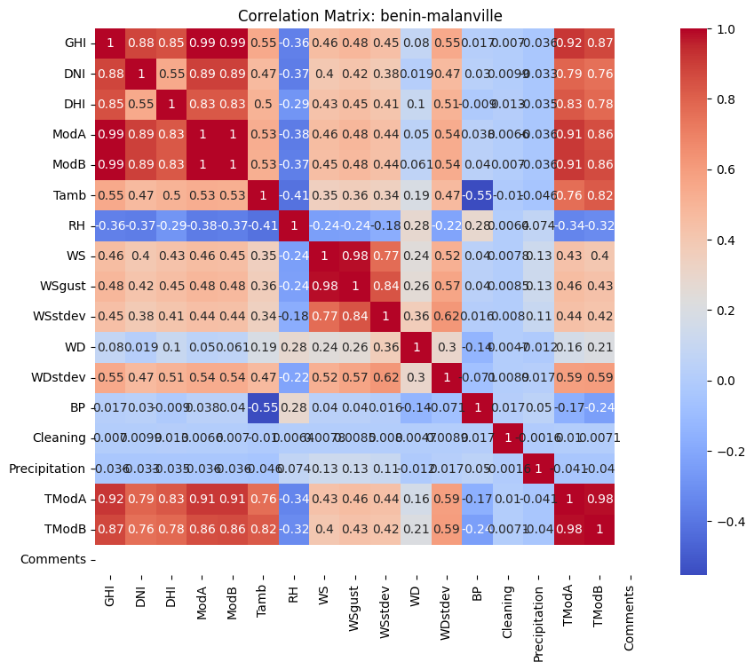
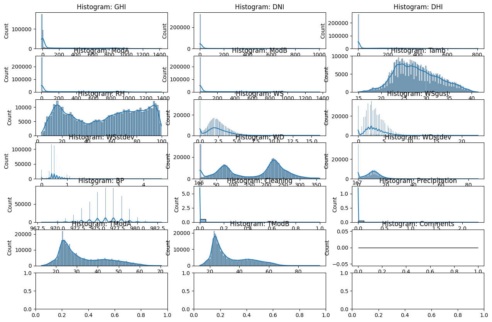
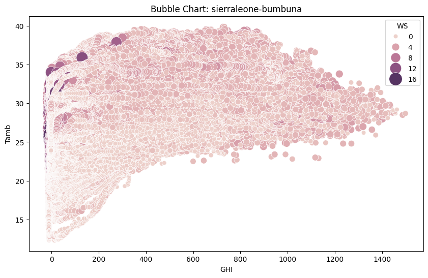

# 10 Academy: Artificial Intelligence Mastery Week 0 Challenge Document

This repository contains solutions for the Week 0 Challenge, focusing on Exploratory Data Analysis (EDA) and creating a Streamlit-based interactive dashboard.

## 1. Exploratory Data Analysis (EDA)

This component involves performing EDA on three CSV datasets. The steps include:

Key Tasks:

Summary Statistics: Generating descriptive statistics for numeric columns.

Data Quality Check: Identifying missing values, outliers, and incorrect entries.

Time Series Analysis: Visualizing trends in GHI, DNI, DHI, and Tamb over time.

Correlation Analysis: Examining relationships between solar irradiance, temperature, and wind conditions.

Wind and Temperature Analysis: Using radial bar plots and histograms for wind and temperature patterns.

Bubble Charts: Visualizing complex relationships between variables like GHI, Tamb, WS, and RH.

Data Cleaning: Handling missing values and anomalies.

Implementation:

The script is located in scripts/eda_analysis.py.

Results such as plots and cleaned datasets are saved in the scripts directory.

Data files should be placed in the data/raw folder.

Usage:

Place the CSV files in the /data/raw/ directory.

Run the script using:

python scripts/eda_analysis.py

Results will be stored in scripts/plots and scripts/summary.

## Dash Board

1. Interactive Dash
2. This component involves developing a user-friendly dashboard to visualize insights from the datasets.

Features:

Dynamic Data Loading: Upload and analyze multiple CSV files dynamically.

Interactive Widgets: Utilize sliders, buttons, and dropdowns for enhanced user interaction.

Visualization:

Time Series Plots

Correlation Matrices

Histograms

Wind Rose Plots

Bubble Charts

Implementation:

The dashboard script is located in scripts/streamlit_dashboard.py.

Dependencies are listed in requirements.txt.

Usage:

Install dependencies:

pip install -r requirements.txt

Run the dashboard locally:

streamlit run scripts/streamlit_dashboard.py

Upload CSV files in the sidebar to explore insights.

Deployment:

The dashboard can be deployed using Streamlit Community Cloud:

Navigate to Streamlit Community Cloud.

Connect the repository and set the entry point to scripts/streamlit_dashboard.py.

Publish the app and share the public URL.

Folder Structure

├── .vscode/
│ └── settings.json
├── .github/
│ └── workflows/
│ ├── unittests.yml
├── data/
│ ├── raw/
│ │ ├── benin-malanville.csv
│ │ ├── sierraleone-bumbuna.csv
│ │ └── togo-dapaong_qc.csv
│ └── processed/
├── scripts/
│ ├── eda_analysis.py
│ ├── streamlit_dashboard.py
│ └── plots/
├── requirements.txt
├── README.md
└── tests/

Key Performance Indicators (KPIs)

EDA:

Data Quality: Handling of missing values and anomalies.

Visualization Effectiveness: Clear and meaningful plots.

Dashboard:

Usability: Intuitive navigation and interactive features.

Deployment: Fully functional and accessible public URL.

Dependencies

Python 3.8+

Pandas

Numpy

Matplotlib

Seaborn

Scipy

Streamlit

Contact

For any questions or issues, please create an issue in the repository or contact the project maintainer.

# Prepared bY: Gashaw Getaneh

# gitHub link:

Date Nov 12,2025
